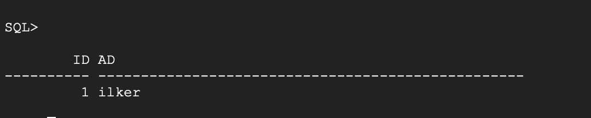

# Oracle XE: Create User, Table, and Insert Data (with Troubleshooting)

This guide explains how to create a user, grant privileges, and insert data into a table in **Oracle Database 21c XE (Docker)**.  
It also shows how to handle common errors you might face during the process.

---

## 1. Connect to Oracle Container

```bash
sudo docker exec -it oraclexe bash
sqlplus sys/ORACLE@//localhost:1521/XE as sysdba
```
Screenshot:


## 2. Switch to the Correct Container (PDB)

To create a user, you must switch to the pluggable database (PDB):
```bash
ALTER SESSION SET CONTAINER = XEPDB1;
```

## 3. Create User & Grant Privileges

```bash
CREATE USER testuser IDENTIFIED BY testpass;
GRANT CONNECT, RESOURCE TO testuser;
```
Screenshot:


## 4. Connect as the New User

```bash
CONNECT testuser/testpass@//localhost:1521/XEPDB1
```
Screenshot:


## 5. Create Table & Insert Data (You May Get an Error)

```bash
CREATE TABLE deneme (id NUMBER, ad VARCHAR2(50));
INSERT INTO deneme VALUES (1, 'ilker');
```
If you see an error like:
```bash
ORA-01950: no privileges on tablespace 'USERS'
```
It means the new user does not have quota for the tablespace.

## 6. Fix the Quota Issue

Connect again as SYSDBA and grant unlimited quota:
```bash
CONNECT sys/ORACLE@//localhost:1521/XEPDB1 AS SYSDBA
ALTER USER testuser QUOTA UNLIMITED ON USERS;
```

## 7. Insert Data and Query Again

Reconnect as testuser and try again:
```bash
CONNECT testuser/testpass@//localhost:1521/XEPDB1
INSERT INTO deneme VALUES (1, 'ilker');
SELECT * FROM deneme;
```
Output:
```
        ID AD
---------- -----------------
         1 ilker
```
Screenshot:


## Notes & Troubleshooting
	•	In Oracle 21c XE, users must be created in the PDB (XEPDB1), not in the root container.
	•	If you get ORA-01950 error, grant unlimited quota on USERS tablespace as shown above.
	•	Show all relevant SQL*Plus output in your screenshots.
 
